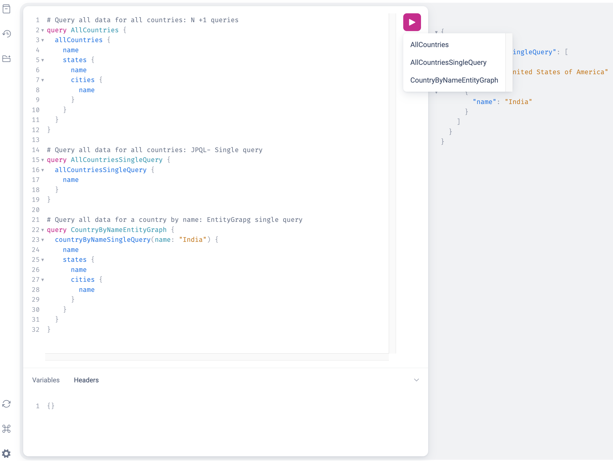

# Country-State-City
A simple [Spring Boot](https://spring.io/projects/spring-boot), [Spring Data JPA](https://spring.io/projects/spring-data-jpa),
[Spring GraphQL](https://spring.io/projects/spring-graphql) application to demonstrate the 
[Classic N+1 Database query problem](https://stackoverflow.com/questions/97197/what-is-the-n1-selects-problem-in-orm-object-relational-mapping)
along with solution using both JPA JPQL [@Query](https://docs.spring.io/spring-data/jpa/reference/jpa/query-methods.html), 
and JPA [@EntityGraph](https://docs.spring.io/spring-data/jpa/reference/jpa/query-methods.html#jpa.entity-graph).

# Getting Started

## Prerequisites

### JDK 21
Make sure that you have JDK 21 installed and the current version is set to 21 in your path and IDE.
[SDKMAN](https://sdkman.io/) is a very nice tool to manage multiple version of SDKs including Java, Spring Boot, Maven
and many others.

### Docker Compose managed `PostgreSQL DB`  
> **NOTE**  
> You need to have the `docker` and `docker compose` (or `docker-compose`) CLI applications on your path. The minimum
supported Docker Compose version is `2.2.0`.
>

## Building and Running the app

### Using Maven wrapper
You can build and run the application using the following commands from the application root directory:
```shell script
# clean, and run the app
./mvnw clean spring-boot:run
```

### Seeded with Test Data
The application's database is seeded with some test data: a couple of Countries, each Country with a couple of States 
and each State with a couple of Cities.

### GraphiQL query console
Once the application comes up, open the browser and hit http://localhost:8080/graphiql?path=/graphql for GraphiQL gui 
console and run GraphQL queries. The following are some sample queries:
```graphql
# Query all data for all countries: N +1 queries
query AllCountries {
    allCountries {
        name
        states {
            name
            cities {
                name
            }
        }
    }
}

# Query all data for all countries: JPQL- Single query
query AllCountriesSingleQuery {
    allCountriesSingleQuery {
        name
    }
}

# Query all data for a country by name: EntityGraph single query
query CountryByNameEntityGraph {
    countryByNameSingleQuery(name: "India") {
        name
        states {
            name
            cities {
                name
            }
        }
    }
}

query StatesByPopulationGreaterThan {
    statesByPopulationGreaterThan(population: 10000000) {
        id
        name
        code
        population
    }
}

# Query states by population greater than: Specific fields of Entity and non Entity object
query StatesByPopulationGreaterThanJpql {
    statesByPopulationGreaterThanJpql(population: 100000) {
        name
        population
    }
}

# Query states by population greater than: Specific fields data as raw Object
query StatesByPopulationGreaterThanJpqlRaw {
    statesByPopulationGreaterThanJpqlRaw(population:200000) {
        name
        population
    }
}
```

### GraphiQL Screenshot


> **NOTE**  
> You can check your application logs for the generated SQL.

### Reference Documentation
For further reference, please consider the following sections:

* [Official Apache Maven documentation](https://maven.apache.org/guides/index.html)
* [Spring Boot Maven Plugin Reference Guide](https://docs.spring.io/spring-boot/docs/3.2.3/maven-plugin/reference/html/)
* [Create an OCI image](https://docs.spring.io/spring-boot/docs/3.2.3/maven-plugin/reference/html/#build-image)
* [Spring Boot Testcontainers support](https://docs.spring.io/spring-boot/docs/3.2.3/reference/html/features.html#features.testing.testcontainers)
* [Testcontainers Postgres Module Reference Guide](https://java.testcontainers.org/modules/databases/postgres/)
* [Spring for GraphQL](https://docs.spring.io/spring-boot/docs/3.2.3/reference/htmlsingle/index.html#web.graphql)
* [Spring Data JPA](https://docs.spring.io/spring-boot/docs/3.2.3/reference/htmlsingle/index.html#data.sql.jpa-and-spring-data)
* [Docker Compose Support](https://docs.spring.io/spring-boot/docs/3.2.3/reference/htmlsingle/index.html#features.docker-compose)
* [Testcontainers](https://java.testcontainers.org/)
* [Flyway Migration](https://docs.spring.io/spring-boot/docs/3.2.3/reference/htmlsingle/index.html#howto.data-initialization.migration-tool.flyway)
* [Spring Web](https://docs.spring.io/spring-boot/docs/3.2.3/reference/htmlsingle/index.html#web)
* [Spring Boot Actuator](https://docs.spring.io/spring-boot/docs/3.2.3/reference/htmlsingle/index.html#actuator)

### Guides
The following guides illustrate how to use some features concretely:

* [Building a GraphQL service](https://spring.io/guides/gs/graphql-server/)
* [Accessing Data with JPA](https://spring.io/guides/gs/accessing-data-jpa/)

### Docker Compose support
This project contains a Docker Compose file named `compose.yaml`.
In this file, the following services have been defined:

* postgres: [`postgres:latest`](https://hub.docker.com/_/postgres)

Please review the tags of the used images and set them to the same as you're running in production.

### Testcontainers support

This project uses [Testcontainers at development time](https://docs.spring.io/spring-boot/docs/3.2.3/reference/html/features.html#features.testing.testcontainers.at-development-time).

Testcontainers has been configured to use the following Docker images:

* [`postgres:latest`](https://hub.docker.com/_/postgres)

Please review the tags of the used images and set them to the same as you're running in production.

### [GraphiQL](https://github.com/graphql/graphiql)

http://localhost:8080/graphiql?path=/graphql

### [Postman](https://learning.postman.com/docs/sending-requests/graphql/graphql-client-first-request/)

http://localhost:8080/graphql  
Postman also offers `Schema refresh` option for refreshing GraphQl schema. Similar to 
[Graphiql](https://github.com/graphql/graphiql)'s `Re-fetch GraphQL schema` option.
